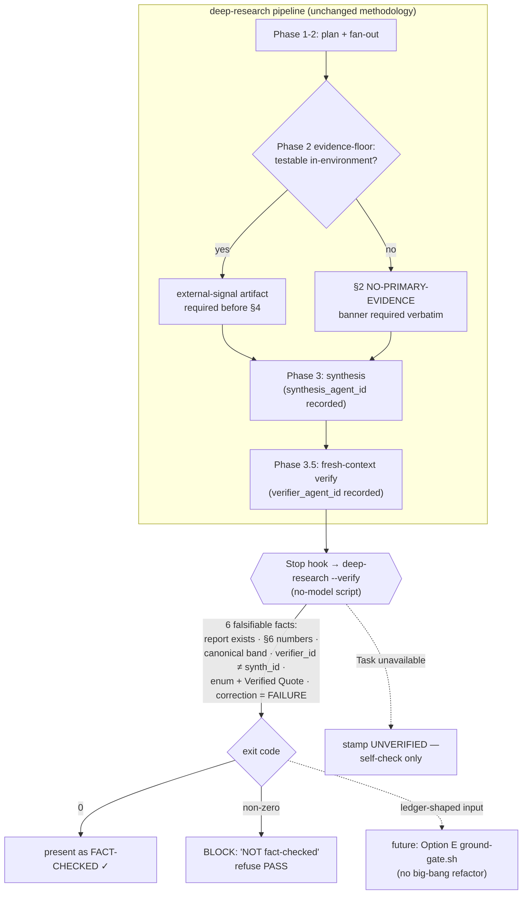

# Brainstorm: Next-Gen Research + Invention Engine

*Date: 2026-06-05 | Tracks: 3 edge-axes | Options: 5 | Council: 9 voices*

## Problem Definition

Both `deep-research` and `brainstorm` are mature. They reliably fan out, synthesize, and present cited
work. The sharpened problem is not "do more research" or "ideate better" — it is that the field's
load-bearing weakness, and ours, is **verify/ground**, and we have **no invention loop** that closes
on reality.

Two facts force the framing. First, the audit shows our "blind" verification gate is self-certification:
it has never once failed across 7+ runs, it is honor-system, and it is demonstrably gameable (the
reveal-s11 retroactive `cached/partial` reclassification; troth shipped with zero quote sections and no
verification report). A gate that cannot fail is theater wearing a green check. Second, the corpus's
single best artifact (the reveal portrait brainstorm — 21 live API calls, MAE 3.32/255) won precisely
because it touched reality, by hand, because the skill never asked it to. The §3 framework names the
mechanism plainly: "if the model checks itself, you have built a confident hallucination machine." The
only thing that makes verification real is an **external signal**, not a fresh re-reader.

Why now: the skills are mature enough that the next marginal gain is not a fourth framework — it is
making the three gates we already advertise actually fire, and then earning the right to add an invention
primitive on top of a foundation that can tell honored from skipped.

**Constraints (with tensions flagged):**

- **Portable / vendor-neutral.** Everything ships as markdown SKILL.md + reference files + Claude Code
  hooks + the Task tool + optional MCP. No new runtime, no model infra. *Tension:* the only non-fakeable
  enforcement primitive this stack offers is a no-model script run by a Stop hook — so "fail-closed" is
  bounded to what a context-blind script can see on disk, never to model-blindness or truth.
- **ADHD-aware.** Reduce unfun work; the heavy tier is already a ~14k-token wall and tired agents route
  around friction. *Tension:* every fail-closed gate adds friction at the moment of least commitment
  (Stop, when the user just wants to be done). A single false-positive rejection on cosmetic nits trains
  permanent avoidance.
- **Anti-walled-garden.** Win on trust + openness, not corpus size or compute we can never match.
  *Tension:* the Claude Code marketplace delivers reach but deepens Claude-Code coupling — "on the
  marketplace" is reach, not portability, and conflating the two quietly undercuts the third leg of the
  triad.
- **Sequencing tension (the sharp one):** distribution amplifies whatever it ships. Publishing forkable
  scored cards + verification reports as marketing means any skeptic can fork them and discover the
  self-certifying gate firsthand. Open distribution *before* the fail-closed fix turns our strongest
  asset into our most public liability. The distribution play is therefore gated on the depth play.

## Research Summary

Three edge-axes, each with its buildable findings.

### Axis (a) — Invention primitive: an INVENT→validate loop on the markdown + Task-tool stack

- **Real invention is contradiction RESOLUTION, not the matrix.** `brainstorm` today flags constraint
  tensions then trades them off (audit.md:393-396). The fix is TRIZ *separation* — split conflicting
  properties in TIME, SPACE, CONDITION, or SCALE (convertible hardtop; variable-geometry wing; overpass
  vs. traffic light) — yielding a NEW option that holds both poles. One ~40-60 line markdown reference
  (4 separation moves + Ideal Final Result + the 40 principles as a reasoning MENU + 6-8 worked
  examples) plus one prompt step. Do NOT copy AutoTRIZ's Module 3 (a hard 39×39 matrix lookup that is
  near-random for mechanical problems and was abandoned by Altshuller himself; arxiv 2403.13002v2). Keep
  only the defensible heuristics and let the LLM reason over them.
- **Co-Scientist's tournament is portable as a markdown + Task loop** and adds the missing
  generate→rank→**EVOLVE** move (DeepMind co-scientist; analysis.md:513-516). Options seed at Elo 1200;
  pairwise comparisons via fresh-context judges; top pairs get a multi-turn debate, lower pairs cheap
  single-turn (built-in cost tiering for the ADHD mandate); upsets move more points. Evolution
  synthesizes a NEW candidate from the top-two strengths (combine, simplify, make feasible, address
  weakness) that re-enters the tournament. ~N log N judgments, not all-pairs.
- **The loop must close on an EXTERNAL signal and stay diverse.** Inject analogies as CONTRASTS (force
  articulation of how our problem DIFFERS), not templates — direct transfer causes ~10.7% homogenization
  (Doshi-Hauser). Engineer diversity BEFORE ranking (similarity-cluster dedup; regenerate collapsed
  regions with diverse personas + CoT). Run each pairwise comparison as a fresh-context judge with
  authentic (not scripted) dissent (Nemeth; Huang 2024: critics help only with an external signal). End
  in a Phase 4.5 empirical probe — a Task agent RUNS a cheap test and Elo moves on the MEASURED result
  (A-Lab's 41 candidates collapsed to ~zero without it; Sakana cannot self-assess).

**Buildability:** fits entirely in the current architecture as an OPTIONAL phase gated to high-stakes
brainstorms, in three increments: (1) markdown-only `contradiction-resolution.md` + one post-council
step; (2) one Elo + one evolution pass via fresh-context Task judges; (3) full diversity guard +
Phase 4.5 probe. Degrade to inline single-context if Task is unavailable — and STAMP it, never silently.

### Axis (b) — Methodological depth: make verify real and fail-closed

- **Make the verify leg fire:** a no-model `deep-research --verify` script + a Stop hook that blocks
  presentation, rejects `verifier_id == synthesis_id`, asserts the manifest, and sets a machine status.
  Add cheap entailment (MiniCheck 770M ≈ GPT-4 at 400× less; 2404.10774) via a fresh Task agent: quote
  + claim vs. re-fetched source. This is the audit's recs #1-6 on the current stack with zero new model
  infra — it makes the adversarial leg real.

**Buildability:** no-model verify script + Stop hook + SKILL.md restructure (Phase 3.5 entailment, lazy
loading, Phase-1 tier, evidence-floor), optional MCP. **Risks:** a too-strict verify trains bypass (do
cheap checks first); an in-harness judge is context-blind, not model-blind.

### Axis (c) — Open distribution: the methodology as the canonical open, vendor-neutral, inspectable standard

Ships in three concentric rings, smallest first:

- **Ring 1 — make the artifact the marketing** (pure markdown, days): concentrate scattered scored
  source cards + §1-§7 reports into a public `docs/research/showcase/` with 2-3 exemplars (the
  meta-review is the flagship), their full `sources/` trees and `verification-report.md` intact, plus a
  one-page `METHOD.md`. A competitor emits prose; we emit a diffable evidence tree anyone can re-run.
- **Ring 2 — package as an installable plugin** on the git-native Claude Code marketplace (mechanics
  proven by borg-collective's `noah-local`): one `research-tools` plugin bundling `/deep-research` +
  `/brainstorm` + the verification hook + the MCP adapter, with a semver string — the precondition for
  any adoption claim.
- **Ring 3 — academic reach without an indexing war** via an MCP adapter to a FREE scholarly corpus
  (audit rec #10). Do NOT write one — 5+ open-source Semantic Scholar MCP servers ship today. Prefer
  **OpenAlex** (250M+ works, CC0, no API key, no rate-limit friction) behind a thin first-party adapter;
  route academic/clinical → OpenAlex, AI/ML/CS → Semantic Scholar, general → WebSearch. The card
  pipeline is the moat; the corpus is a swappable backend.

**Findings:** OpenAlex is the live precedent — a CC0 nonprofit catalog that DISPLACED paid Scopus
(Sorbonne deregistered Dec 2023; French Ministry of Research funding 2024) on trust/transparency, not
size. Open standards repeatedly beat proprietary tools on auditability (Jupyter overtook Mathematica and
was adopted as the frontend by the cloud giants; Docker reached 24M+ devs on signed, auditable images).
**The load-bearing caveat:** a systematic study of published Jupyter notebooks found most artifacts could
not actually be re-run — credibility requires *Visible, Trackable, **Forkable** + executable*, not just
posted files. So Ring 1's exemplars must ship with a re-run harness, and the whole play is GATED on
axis-(b) landing first — distribution amplifies whatever it ships, including a gate that never fires.

## Solution Options

### Option A — The Contradiction Forge

**Lead axis:** (a) Invention primitive — the cheap 80/20 reasoning cut.

**What:** A new optional Phase 4.5 (and a `/invent` entry) that converts the council's trade-off table
into a contradiction-RESOLUTION step. Where `brainstorm` flags tensions then trades them off, the Forge
takes each named tension as a formal contradiction (improve X without worsening Y) and forces a NEW
option that holds both poles, using TRIZ separation (time / space / condition / scale) + Ideal Final
Result — and explicitly REFUSING the discredited 39×39 matrix. The bet: the missing move in the whole
field is not more generation or more ranking, it is the disciplined act of dissolving a trade-off, and
that move is ~50 lines of markdown the LLM is already good at.

**How:** Runs after `brainstorm` produces 3-5 options and BEFORE the council. (1) Extract contradictions
from the option set's Key-tradeoffs fields and Phase-1 tensions; restate each as a canonical pair. (2)
Lazy-load `contradiction-resolution.md`. (3) Propose at least one NEW option per top contradiction,
tagged with the separation move used. (4) New options re-enter the council as full Option blocks. (5)
The council must judge whether each resolved option truly holds both poles or smuggled a hidden cost.
Output: the normal doc, but §4 now contains "invented" options with resolution lineage + a short
Contradiction Ledger. Gated: fires only on a genuine Phase-1 tension.

**Pros:**
- Smallest possible true invention primitive — pure markdown + one prompt step, zero new runtime, drops
  into existing phase ordering.
- Directly closes the named gap (audit.md:393-396) — turns a documented weakness into the headline.
- Avoids the field's biggest trap by construction: ships only TRIZ's defensible heuristics, refuses the
  matrix.
- Cheap to gate — a 40-line UX decision pays nothing.
- Makes the council's job harder in the RIGHT way: it now has a resolved option to attack — the
  authentic-dissent surface the audit says is missing.

**Cons:**
- No external grounding — a "resolved" option can be a fluent fiction that hides the trade-off (the
  A-Lab/Sakana self-assessment failure).
- Resolution quality is unmeasured — AutoTRIZ's own authors concede "no objective mechanism to evaluate
  effectiveness."
- Risks homogenizing if worked examples become templates rather than contrasts (~10.7% penalty) — the
  guard is prose discipline, not a mechanism.
- Adds a phase — even gated, it lengthens the heavy tier and adds one more place a tired agent can route
  around.

**Tradeoffs:** You concede measured invention QUALITY for shipped-this-week invention DISCIPLINE. The
Forge guarantees the model ATTEMPTS resolution and records lineage; it does NOT guarantee the resolution
is real. The Ledger can show "3 of 4 resolved" while one is a hidden-cost mirage. This is invention
WITHOUT closed-loop validation by design — the precise failure pattern §3 warns about. Accepting that is
the price of the smallest footprint.

**Feasibility:** High. One ~50-line reference file + ~15 lines into SKILL.md + a Ledger template. No
Task tool, no MCP, no code, no hooks. The single dependency-free increment in the whole proposal.

**Estimate:** 1-2 sessions.

**MVV:** `contradiction-resolution.md` (4 separation moves + Ideal Final Result + 6 contrast examples) +
one Phase-4.5 step that produces at least ONE option resolving a real Phase-1 tension, re-entered into
the council. No ledger, no lineage tags — just prove the model can dissolve one trade-off.

**Distinct because:** It bets the invention primitive is a REASONING move, not infrastructure — ~80% of
the value from one disciplined both-poles step, zero new machinery. Unlike B it deliberately does NOT
close the empirical loop; it accepts unverified invention as the cost of shipping in 2 sessions. The
80/20 cut of the invention axis, and the only option that ships value before any enforcement lands.

---

### Option B — Tournament Of Tested Options

**Lead axis:** (a) Invention primitive — the maximalist closed-loop version.

**What:** A full research → brainstorm → INVENT → VALIDATE loop, shipped as `/invent`, that ports Google
Co-Scientist's generate → rank → EVOLVE tournament onto our markdown + Task-tool stack and CLOSES it on
an external signal. After the council scores options, they enter an Elo tournament judged by fresh-context
Task agents (not the synthesis author), the top two are bred into a new evolved candidate via
contradiction resolution, and — the load-bearing move no competitor's portable artifact makes — a cheap
real-world probe is RUN by a Task agent and Elo moves on the MEASURED result, not the argued one. The
bet: invention is only real when ranking is blind and validation touches reality. This reproduces, by
design, the corpus's best artifact (reveal portrait), which the skill currently never asks for.

**How:** Phase 5 (Tournament) replaces the one-shot council. (1) Diversity guard FIRST: cluster by
similarity; regenerate collapsed regions with diverse personas + analogical CONTRASTS. (2) Seed every
option at Elo 1200 in `elo-table.md`. (3) Pairwise comparisons via FRESH-CONTEXT Task agents with a
recorded ID distinct from synthesis; obvious gaps get single-turn, the top pair gets ONE multi-turn
round with authentic dissent. (4) Evolution: breed a NEW candidate from the top-two strengths, re-enter.
(5) Phase 5.5 empirical probe: a Task agent RUNS a cheap in-environment test, commits the harness, writes
`tournament-result.md` with the measured number; Elo moves on that. (6) No probe possible → the leader is
stamped NO-PRIMARY-EVIDENCE, never silently passed.

**Pros:**
- The first PORTABLE, vendor-neutral, on-disk implementation of the Co-Scientist loop — a capability
  locked inside DeepMind's stack — closed on an EXTERNAL signal.
- Fixes the two deepest audit findings at once: the never-failing self-graded gate AND the one-shot
  council that ratifies the cheapest option.
- Reproduces the corpus's OWN best result by design (reveal measured in-environment; this asks every
  time).
- The evolved candidate is genuine invention: it BREEDS from the top two and must win on merit.
- Every artifact (`elo-table.md`, `tournament-result.md`, agent IDs) is forkable markdown.

**Cons:**
- Heaviest option by far — risks becoming the new 14k-token wall; must be hard-gated.
- The probe is only as good as the test the model designs — a cheap probe measuring the wrong thing
  decisively gives false confidence (the deepest A-Lab risk); needs an "is this test decisive?" check.
- Hard-depends on the Task tool; degrades to context-blind inline judging where Task is unavailable.
- Elo on a tournament the model partly runs is gameable UNLESS agent-ID distinctness is ENFORCED — so
  its integrity leans on Option C's enforcement work, coupling two workstreams.
- Multi-turn debate + live probe is many minutes/tokens; pairwise LLM judging is noisy, so the SAME
  option set can crown different winners across runs.

**Tradeoffs:** You concede ADHD-friendly lightness for end-to-end rigor — this can NEVER be the default
tier. You concede that integrity is not self-contained — the blindness guarantee requires Option C's
executable check. You concede that "measured" ≠ "correct," and must spend tokens on a probe-validity
check you cannot fully automate. And you concede determinism: you trade a reproducible-but-fake ranking
for an honest-but-noisy one.

**Feasibility:** Medium. All primitives exist with an in-corpus precedent, but it is the most
code-and-prompt-heavy build (similarity guard, Elo rule, fresh-context orchestration, evolution prompt,
probe-runner = five subsystems) and needs Option C's `--verify`/hook to make agent-ID distinctness
enforceable.

**Estimate:** 5-8 sessions (Increment 1 tournament+Elo ~2; Increment 2 evolution + diversity guard ~2;
Increment 3 probe + NO-PRIMARY-EVIDENCE stamp + agent-ID hook ~3).

**MVV:** Increment 1 only — after the council scores 3-5 options, run ONE pairwise round via fresh-context
Task agents (single-turn, recorded distinct IDs) writing `elo-table.md`, then ONE evolution pass that
breeds a 5th candidate and re-ranks. No diversity guard, no live probe — but already blind ranking + an
evolved option, more than the one-shot council does today.

**Distinct because:** It bets invention is worthless without an EXTERNAL signal AND blind ranking — and
uniquely FUSES the invention primitive with the verify/ground leg: the tournament is where invention and
verification become the same machinery, ending on a measured number. The only option that reproduces, by
design, the corpus's single best artifact.

---

### Option C — Fail-Closed Ground Gate (enforce the check AND raise its target) **[RECOMMENDED]**

**Lead axis:** (b) Methodological depth — make verify/ground real and fail-closed.

**What:** The complete axis-(b) bet, in two halves driven by one mechanism. HALF 1 (make the existing
gate unfakeable): a no-model `deep-research --verify` script + a Stop hook that physically blocks a
report from being presented as fact-checked until an out-of-process check passes — converting every
honor-system manifest checkbox into a machine assertion that fails the deliverable when skipped. HALF 2
(raise what "verify" MEANS): reframe verification from re-reading citations to GROUNDING against a signal
outside the model — for any cheaply testable question, the pipeline must produce at least one
direct-observation artifact before synthesis, and any report lacking one wears a blunt "NO PRIMARY
EVIDENCE — all findings are literature-derived predictions" banner in §2. The first half makes
citation-checking impossible to fake; the second says a perfectly-verified citation still only proves a
source SAID X, never that X is true in the user's environment.

**How:** Mechanical layers on the current markdown + hooks + Task stack, no new runtime. (1) No-model
verifier (`hooks/deep-research-verify.sh`) asserts the falsifiable facts: every card carries the literal
`Access status:` enum + a `## Verified Quote(s)` heading; `verification-report.md` exists; §6 has sample
N + failure count + a canonical band string; sample ≥30%; recorded verifier ID ≠ synthesis ID; a quote
attributed to a domain other than its card URL auto-`failed`; a card lacking the enum auto-`failed`;
`cached/partial` honored only if git/mtime shows the flag predates synthesis (closes the reveal-s11
game); correction-then-recount forbidden — a card corrected during verification counts as a FAILURE. Any
failure exits non-zero. (2) Stop hook gates PRESENTATION: on non-zero it injects a blocking "NOT
fact-checked" message and refuses PASS. (3) Phase 2 evidence-floor: classify whether the question is
testable in-environment; if yes, an external-signal artifact is REQUIRED before §4; if not, the §2
banner string is required verbatim. (4) A >3:1 agree:disagree ratio becomes a gate, forcing a
falsification query + a steel-man-the-contrarian subsection. (5) Cheap MiniCheck-style entailment
add-on: a fresh Task agent tests quote + claim against the refetched source. (6) Honest fallback: if
Task is unavailable, stamp "UNVERIFIED — self-check only," never print PASS.

**Pros:**
- Fixes the single highest-impact finding in the audit (Pattern 2 + findings 1-3): the gate that has
  never once failed becomes one that can. The audit's recs #1-#5 in one mechanism.
- Turns the partly-fictional adversarial leg of the triad into a true one — the positioning claim
  finally holds when a skeptic forks it.
- Imports §3's central finding as the product spine: an EXTERNAL signal, not a fresh re-reader, is what
  makes verification work — raising the evidence floor from ~14% primary toward ≥1 ground-truth
  observation per testable run.
- Pure enforcement, zero methodology rewrite — cheap, deterministic, unbypassable on the facts a script
  can see.
- Cheap-checks-first ordering means the gate is not the expensive thing agents skip.

**Cons:**
- A no-model script is context-blind, not model-blind: it confirms a DIFFERENT agent ID was recorded and
  a quote exists on the page, but cannot judge whether that agent was genuinely uninfluenced.
- Coverage is uneven: historical/ethical/market/clinical questions are not cheaply testable, so the
  evidence-floor degrades to a confession banner.
- The "is this testable?" classification is itself dodgeable — declaring everything untestable escapes
  the work via the banner.
- The git/mtime check is heuristic and brittle on rebased/squashed/fresh histories; entailment adds an
  LLM call per sampled card with judge bias.
- A too-strict gate trains bypass if it rejects on cosmetic enum-format nits.

**Tradeoffs:** You buy a real fail-closed guarantee at the cost of friction at the moment of least
commitment, and you accept that "fail-closed" is bounded to what a no-model script can SEE on disk plus
one cheap entailment call — it enforces that a distinct agent ran and the files prove it, NOT that the
agent's mind was blind or the probe measured the right thing. The honest fallback and the banner mean
some real runs ship wearing a downgrade stamp instead of a green check — the price of never lying. A
self-run, self-interpreted probe is only a PARTIAL external signal, so interpretation should ideally
hand off to a fresh agent, adding the ceremony the ADHD mandate fights.

**Feasibility:** High. There is no `hooks/` directory yet, so the Stop hook + verify script are clean
net-new files; the manifest and Phase 3.5 are prose convertible assertion-by-assertion; the
distinct-agent-ID and entailment legs use the Task tool Phase 3.5 already mandates. No MCP, no model
infra, fully portable markdown + bash. The enforcement half is High; the evidence-floor half is softer
(a script can assert the artifact EXISTS, not that the test was valid) but ships on the same stack.

**Estimate:** 4-6 sessions (~1.5 verify script + Stop hook + exit-code semantics; ~1.5 SKILL.md
Phase-3.5/manifest restructure; ~1 Phase-2 evidence-floor classifier + banner + confirmation-skew gate;
~1 entailment add-on + backfill/test against the corpus — reveal s11 and troth are the fixtures the gate
must catch).

**MVV:** The no-model verifier run by a Stop hook asserting just six things: `verification-report.md`
exists, §6 has the three numbers, the band string is canonical, recorded verifier ID ≠ synthesis ID,
every card has the enum + Verified Quote heading, and a card corrected during verification counts as a
failure. That single artifact would have FAILED troth (no report) and reveal (no fresh agent, missing
s11 enum, retroactive cached/partial) on the day they shipped.

**Distinct because:** It bets the win is ENFORCEMENT plus RE-TARGETING, not new invention. It is the only
option whose headline is a structural impossibility ("cannot present as fact-checked unless proven") and
that treats the no-model script — not an LLM — as the load-bearing adversary. Unlike E it does NOT
rearchitect the skills; it hardens the one that exists, the fastest path to a true adversarial leg.

---

### Option D — The Forkable Open Standard

**Lead axis:** (c) Open distribution — method-as-standard, winning on trust and reach.

**What:** Package the method as the canonical open, vendor-neutral, inspectable standard, in two
concentric rings. RING-CORE (reproducibility moat): ship the methodology as a published, versioned METHOD
spec whose proof-of-trust is a small set of exemplar projects a skeptic can FORK and RE-RUN to regenerate
the same scored cards and the same verification result, watching the fail-closed gate actually fire.
RING-REACH (adoption flywheel): package the whole pipeline as a one-command Claude Code plugin on a
git-native marketplace, and close the no-web-scale-corpus gap by wiring a FREE CC0 scholarly backend
(OpenAlex first) behind a thin FIRST-PARTY adapter. The bet: don't out-spend or out-index the big labs —
out-OPEN them, using OpenAlex's real defeat of paid Scopus as both backend choice and positioning
template. The whole play is GATED on Option C landing first.

**How:** RING-CORE first. (1) `METHOD.md` + `CONFORMANCE.md` (the machine-checkable invariants). (2)
Ship `deep-research --verify` (shared with Option C) printing a conformance badge (PASS / LOW-CONFIDENCE
/ UNVERIFIED). (3) Publish 2-3 exemplars in `docs/research/showcase/` with full `sources/` trees +
regenerated `verification-report.md`, each with a fork-and-verify README; commit fetch-time content
snapshots so a re-run checks the CARD against the snapshot, not the non-deterministic live URL. Backfill
the existing corpus to conformance BEFORE publishing. RING-REACH second. (4) A `research-tools` plugin
entry (marketplace.json, semver) bundling `/deep-research` + `/brainstorm` + the verification Stop hook.
(5) A thin first-party adapter calling OpenAlex's keyless HTTP API — NOT a third-party MCP — feeding
abstract + DOI + OA PDF link into the standard card. Keep the card schema backend-AGNOSTIC.

**Pros:**
- Turns the audit's #1 liability into the headline: the gate visibly fires on a fork, so "adversarial"
  stops being theater.
- The conformance badge is a trust primitive no competitor can emit — their reports are prose a skeptic
  cannot re-run (a DeepTRACE audit finds 47-97.5% unsupported).
- One-command install + semver turns a private skill into a distributable product; the keyless CC0
  backend needs no secrets to demo and raises the thin-primary-evidence floor.
- First-party OpenAlex adapter sidesteps third-party MCP supply-chain risk entirely; OpenAlex's defeat of
  paid Scopus is the strongest proof-point for the triad.
- Pure markdown + one no-model script + a Stop hook + a thin HTTP adapter — preserves vendor-neutrality,
  ADHD-aware (build-once).

**Cons:**
- Reproducibility theater risk: if an exemplar's re-run does NOT reproduce, the flagship marketing asset
  publicly fails — exemplars must be pre-hardened with committed snapshots.
- Distribution AMPLIFIES whatever it ships: the plugin/showcase MUST follow Option C, not precede it.
- The marketplace deepens Claude-Code coupling while the pitch is vendor-neutrality — reach ≠
  portability.
- `--verify` checks STRUCTURE, not whether the verifier was blind in spirit — the badge certifies process
  conformance, not truth.
- Backfilling + adapter + routing is real scope that can balloon into a platform build.

**Tradeoffs:** You concede determinism (live-web sources mean a re-run can legitimately diverge, so the
harness checks the card against a committed SNAPSHOT). You concede that reach and portability are
DIFFERENT goods bought with different currency. You accept a hard sequencing constraint — nothing public
ships until Option C lands. And you concede that the badge certifies PROCESS, not TRUTH.

**Feasibility:** Medium. RING-CORE is High (`--verify` is rec #1, the Stop hook pattern is proven, the
only new artifacts are two markdown specs + snapshots + re-publishing). RING-REACH is Medium (plugin
mechanics proven, OpenAlex keyless-wrappable, but adds routing logic + a live network dependency + the
hard Option-C prerequisite). Overall Medium because the public face cannot ship before the fix.

**Estimate:** 6-9 sessions (RING-CORE ~3-4; RING-REACH ~3-5), plus the prerequisite Option C work.

**MVV:** `deep-research --verify` (no-model, asserts conformance incl. distinct verifier ID) wired to a
Stop hook that refuses PASS without a distinct verifier ID, plus ONE backfilled conformant exemplar (the
meta-review) published with its regenerated verification-report and a fork-and-verify README. The
smallest thing that is both a fix and a marketing proof.

**Distinct because:** It bets the durable open-distribution moat is REPRODUCIBILITY + OPENNESS, not
features or compute. It deliberately ships the fail-closed fix AS the distribution asset, refuses the
third-party MCP shortcut to keep the trust story clean, and accepts the harder sequencing — the one
distribution play strictly IMPROVED by skeptics forking it.

---

### Option E — The Ground Engine (one loop, three faces)

**Lead axis:** Synthesis — collapse research/brainstorm/invent into ONE Generate-Critique-Ground
primitive where Ground is the only non-fakeable move.

**What:** Stop shipping three skills and ship ONE engine — a single Generate → Critique → Ground loop —
that the three skills merely CALL with different generators and stakes. The audit proves all three
already ARE this loop done badly; §3 proves Ground-against-reality is the load-bearing weakness; the
corpus proves the one artifact that closed Ground (reveal, by hand) won. So make Ground a first-class,
shared, MACHINE-PRODUCED artifact — a `ground.jsonl` ledger written by an EXTERNAL actor, never by the
synthesis agent — that every skill must emit and every skill reads. The differentiator is that the SAME
externally-written ledger is the substrate, so the gate cannot be honored in one skill and faked in
another. Fixing verification, gaining an invention primitive, and making the artifact safely forkable
become ONE change rather than three.

**How:** One shared `lib/ground.*` primitive (in BOTH `lib/ground.sh` for hooks and `lib/ground.zsh` for
the CLI, per the dual-language rule) exposes three verbs. PROPOSE: the generator writes candidates to
disk with a content hash. CRITIQUE: a fresh-context Task agent ranks/refutes and writes its own agent-id.
GROUND: an EXTERNAL actor — re-fetch+entailment for research, a cheap executed probe for brainstorm/
invent — appends a signed line to `ground.jsonl` recording claim/option hash, external signal used,
measured result, verifier agent-id, timestamp. The three skills become thin frontends. A single Stop hook
(`ground-gate.sh`) reads `ground.jsonl` before allowing presentation and HARD-BLOCKS if the file is
absent, any presented claim/option has no grounding line, the verifier id equals the synthesis id, or the
external-signal field is empty. The loop runs once by default; high-stakes runs get ONE extra Critique →
Ground round. When the signal is genuinely unavailable, the actor writes `signal:none` and the gate stamps
UNGROUNDED — never PASS.

**Pros:**
- One engine to maintain instead of three drifting mini-pipelines — directly deletes the finding that
  brainstorm re-implements a divergent parallel pipeline.
- The Ground ledger is written by an external actor and read by a hook, so the SAME fail-closed mechanism
  covers all three skills at once.
- Makes the triad TRUE rather than aspirational: a forked artifact ships a machine-written ledger a
  skeptic can re-run — the precondition Option D needs.
- Reframes "invent" as just-another-generator, so the invention primitive arrives for FREE (subsumes
  Option A's contradiction step as one of three PROPOSE generators).
- Self-consistency + the single-evolve round bolt onto the shared CRITIQUE verb once, benefiting all
  three faces.

**Cons:**
- Large refactor up front: three working skills must be re-pointed before any new value lands — the first
  session or two produces NO user-visible feature, only plumbing.
- A shared abstraction risks leakiness — research's Ground (entailment) and invent's Ground (a measured
  probe) are genuinely different signals.
- The hard Stop-gate blocks real work the first time grounding is legitimately impossible offline.
- Migrating the existing 21-artifact corpus is busywork no one will fund; a bug in `ground.*` breaks all
  three faces simultaneously.
- One-round evolve cap forecloses the maximalist invention ceiling.

**Tradeoffs:** You give up the comfortable illusion of three independently-shippable skills — everything
routes through one primitive, so a bug in `ground.*` breaks all three at once, and the first increment is
pure plumbing. You concede that some runs legitimately end UNGROUNDED and ship with a scarlet banner. You
accept a one-round cap on the evolve loop to keep the ADHD cost ceiling.

**Feasibility:** High on mechanism. The shared primitive is markdown references + one bash hook reading a
JSONL ledger — exactly the executable post-check the audit recommends, generalized to all three skills.
The only subtlety is the dual-language constraint. The risk is schedule/activation (front-loaded
refactor), not technical possibility.

**Estimate:** 4-6 sessions (~1 ledger schema + `ground-gate.sh`; ~1-2 extract verbs + re-point
deep-research; ~1 re-point brainstorm + add invent generator; ~1 fail-closed stamping + UNGROUNDED
banner; ~1 migrate one exemplar).

**MVV:** Ship ONLY the research face first: a `ground.jsonl` written by a fresh-context entailment Task
agent + the `ground-gate.sh` Stop hook that blocks presentation on a missing or self-authored ledger.
That alone makes the flagship's adversarial leg real and proves the ledger substrate. Brainstorm and
invent adopt the SAME ledger in later sessions.

**Distinct because:** Every other option treats invention, depth, and distribution as three things to
ADD. This bets they are ONE thing — an externally-written Ground artifact — and that the highest-leverage
move is to DELETE the three-skill split, not extend it. The only option where fixing verification,
gaining an invention primitive, and making the artifact safely forkable are the SAME change.

## Council Review

**Product Strategist.** The right problem is the field's load-bearing weakness — verification/grounding —
not invention. Option A is a feature in search of the wrong axis: it ships an unverified invention
primitive that is "invention WITHOUT closed-loop validation by design," the exact confident-hallucination
pattern §3 warns against. Option B is the maximalist version the ADHD/indie north star flags as the new
14k-token wall, and its integrity "leans on Option C's enforcement work" so it cannot ship its own
guarantee. Option D is the right distribution play but hard-gated on C, so it is downstream, not the lead.
The real contest is C vs. E. E is the most elegant fit for the Stillpoint shape — one non-fakeable
substrate, invention "for free," portability mechanically true — and it deletes the divergent-pipeline
finding. But E's first increment is "pure plumbing with no headline feature" and the "highest
activation-energy of any option for the ADHD user model." *Preference:* E with a scope constraint — ship
ONLY the research-face MVV first, with C's no-model assertions as the deterministic floor inside the same
gate; defer brainstorm/invent faces and corpus migration. *Dissent:* leading with E bets a lifestyle/
ADHD maintainer can absorb a three-skill refactor whose first sessions ship zero value and whose shared
`ground.*` is a single point of failure for the whole plugin. If the refactor stalls mid-flight — a very
ADHD-real risk — we are left with three half-migrated skills, worse than today, whereas C delivers the
identical highest-impact fix without rearchitecting. The disciplined call may be to ship C's MVV this week
and adopt E's framing only as the migration target C's verifier evolves into.

**The Technical Realist.** Buildability splits the field cleanly. On THIS stack there is exactly ONE
non-fakeable enforcement primitive: a no-model script run by a Stop hook with exit-code semantics.
Everything that claims "fail-closed," "blind," or "machine-checkable" — B's agent-ID enforcement, D's
badge, E's `ground-gate.sh` — reduces to that mechanism, which only C builds directly and which B admits
it "hard-depends" on. That coupling is the tell: B, D, and E are all UNSOUND until C exists, so C is the
load-bearing dependency the whole council is implicitly voting on. C's hidden complexity is bounded and
honestly named (context-blind not model-blind; brittle git/mtime check; one LLM entailment call per
card). B's empirical probe is where buildability collapses: the Task tool gives a fresh-context agent but
NOT a reliable sandboxed executor with network/credentials to run live calls — that path is heterogeneous
per project and degrades to context-blind judging exactly where it matters. E's promise that one
`ground.*` serves entailment AND a probe AND a contradiction-test through one schema is the most likely
thing to break first. *Preference:* C, scoped to its MVV first (six on-disk facts), then the evidence-
floor banner; defer entailment and the git/mtime check. *Dissent:* the one mechanism the stack can build
certifies process, not truth, and is gameable out-of-band — a determined author feeds a "fresh" Task
agent hints before spawning it. If we ship C we must publicly document that the script proves "a distinct
agent ran and the files exist," NOT "the verification was blind or true," or distribution amplifies a
stronger false-confidence claim than the one we set out to fix.

**User Advocate.** The decisive fact for my seat: every honor-system gate has never failed not because
the work was done, but because tired agents route around friction, and the heavy tier is already a
14k-token wall. The question is which design adds the least friction at the moment of least commitment
while delivering value the user can FEEL. Option B is the textbook thing my user routes around — its own
Cons admit it "can NEVER be the default tier." Option E is seductive but its first one-to-two sessions
produce zero user-visible feature — the single most likely thing to be abandoned mid-flight. Option A is
the lightest but ships invention WITHOUT a check, making the tool feel productive while quietly lying.
Option C is the only option whose mechanism REMOVES per-deliverable honor-system burden (build-once, the
script does the remembering), is deterministic, and would have caught the two real corpus failures on
ship day. *Preference:* Option C, ship ONLY the MVV first, and HARD-cap rejection to genuine integrity
failures — never reject on cosmetic enum-format nits. *Dissent:* even C is friction at the worst moment
(Stop, when the user wants to be DONE), and its own Cons name the lethal failure: reject on nits and tired
agents route around the whole pipeline. Worse, the testability classifier lets a tired user declare
questions untestable to dodge the floor — relocating the lie from "I verified" to "this wasn't testable."
Ship the gate fail-closed on the SIX deterministic facts only; ship the evidence-floor as a non-blocking
banner first, earning trust before it ever blocks — the first false-positive rejection trains permanent
avoidance.

**The Pragmatist (effort-to-impact).** §3 names the load-bearing weakness precisely — the model checks
itself — and the audit confirms the gate has NEVER failed across 7+ runs. The real question is what
single mechanism converts the most fictional claims into true ones per session. C is that mechanism, and
its MVV would have FAILED troth and reveal on ship day. Crucially, C is the load-bearing PREREQUISITE for
the boldest options: B concedes its blindness guarantee is "only fully sound shipped WITH Option C," and D
states flatly "nothing public ships until Option C lands." Option A ships "invention WITHOUT closed-loop
validation by design" — it ADDS surface to the exact verification hole before the hole is plugged. E is
elegant but its first sessions produce no user-visible feature. B is too heavy to lead. On
impact-per-session, C wins. *Preference:* Option C, scoped to its MVV first; defer HALF 2's evidence-floor
classifier and entailment. *Dissent:* C's MVV is context-blind, not model-blind — we risk replacing a gate
everyone KNOWS is theater with one that LOOKS rigorous but certifies process, not blindness, a more
dangerous false confidence. Worse, §3 says the real fix is grounding against an EXTERNAL signal, and C's
cheapest increment ships none of that; HALF 2 — the part that raises the ~14% floor — is exactly what the
MVV cuts. If we ship C-MVV and declare victory, we will have hardened the wrong leg and skipped the
load-bearing one.

**The Research Methodologist.** §3 names "an EXTERNAL signal, not a fresh re-reader" as "the single most
important engineering decision in the whole report." Judged strictly on the verify/ground leg, C is the
only option whose ENTIRE design is making verification fail-closed and statement-level: a no-model
out-of-process verifier (every LLM self-check "launders its own output into a pass"), distinct-agent-ID
assertion, MiniCheck-style entailment so "verified" means the quote ENTAILS the claim, the >3:1 gate, and
the evidence-floor. Its MVV would have FAILED both troth and reveal — that is the rigor test passing. E is
methodologically the most elegant and arguably the better END state, but it ships rigor LATER than C for
the same mechanism. B fuses invention with verification and uniquely reproduces the corpus's best artifact
by RUNNING a probe, but its blindness guarantee "requires an executable check" it does not contain. The
methodologically HOLLOW option is A: "invention WITHOUT closed-loop validation by design," the exact
confident-hallucination machine, inheriting AutoTRIZ's admitted lack of an evaluation mechanism. D is
downstream — it GATES on C. *Preference:* C, scope to its MVV first, architected so the verifier reads a
ground-ledger-shaped artifact, leaving a clean migration path to E without a big-bang refactor. *Dissent:*
C's "fail-closed" is bounded to what a context-BLIND no-model script can see, and that boundary is exactly
where gaming survives — out-of-band hint-feeding, plus the self-made testability classifier as the new
honor-system soft spot. C makes the gate UNFAKEABLE on structure but not UNGAMEABLE on judgment; without
B's or E's executed probe as the default for testable questions, C can still certify a fluent literature-
derived prediction as "verified" — the field's weakness relocated, not resolved.

**The Invention/TRIZ Specialist.** Only A, B, and E ship an actual contradiction-RESOLUTION primitive; C
and D contain no invention move. Of the three, the decisive distinction is TRIZ-correct: real invention
requires the resolution move (separate-in-time/space/condition/scale + Ideal Final Result) AND an
ideality check that the both-poles option didn't smuggle a hidden cost. Resolution-without-grounding is "a
confident hallucination machine" (A-Lab/Sakana; AutoTRIZ's own concession). Option A is the correct
REASONING primitive but explicitly amputates the validity check — it can show "3 of 4 resolved" while one
is a mirage, and its homogenization guard is "prose discipline, not a mechanism." Option B is the only one
that closes the loop the way TRIZ demands an invention be PROVEN: it keeps the defensible Altshuller
heuristics, explicitly REFUSES the near-random matrix, runs Elo on a MEASURED probe, and breeds an evolved
candidate that must win on merit — reproducing the reveal artifact by design. E subsumes A's step and
grounds it through an externally-written ledger — structurally the soundest substrate — but caps the
evolve loop at one round and ships zero invention in its first increment. *Preference:* B with a scope
constraint — ship Increment 1 (fresh-context Elo + ONE evolution pass), physically borrow A's
`contradiction-resolution.md` as the evolution operator and C's agent-ID hook so blindness is machine-
checked; defer the live probe. *Dissent:* my own pick carries a TRIZ-specific failure — pairwise LLM-judge
Elo is stochastic and biased, so the SAME resolved option can win one run and lose the next, and the
probe "is only as good as the test the model designs": a cheap probe measuring the wrong quantity
decisively gives a FALSE green light, more dangerous than A's honest "unverified" stamp. Without a hard
"is this probe decisive?" gate, the tournament becomes validation theater that launders pseudo-inventions
with a number.

**The Open-Source Strategist.** The triad (inspectable + adversarial + portable) is the only moat the big
labs structurally cannot copy, but our adversarial leg is currently FICTION — "blind" verify is self-
certification. Distribution before that is fixed is the worst move available: D itself concedes
"distribution AMPLIFIES whatever it ships" and is hard-gated. So my own axis cannot be the answer until
the credibility hole closes. C is the precondition every distribution play depends on, and its MVV would
have FAILED troth and reveal on ship day. The strongest distribution case is D's RING-CORE: the
conformance badge is a trust primitive NO competitor can emit (their reports are prose; DeepTRACE finds
47-97.5% unsupported), and it wins on the historically-validated axis — Jupyter/Docker/OpenAlex all won on
auditability + a freely-implementable spec, with OpenAlex's defeat of paid Scopus as the literal template.
The marketplace and OpenAlex adapter are dilution risk for the openness story: "on the marketplace"
deepens Claude-Code coupling. *Preference:* D with a scope constraint — ship ONLY RING-CORE (METHOD.md +
CONFORMANCE.md + the shared `--verify` + Stop hook from C + ONE backfilled fork-and-verify exemplar with
committed snapshots). Defer RING-REACH until the badge is independently trusted. *Dissent:* a conformance
badge certifies PROCESS, not TRUTH. If we market "fork it and watch the gate fire," the first skeptic who
sees a green PASS then trivially demonstrates a verified-but-false claim does FAR more damage than never
shipping the badge — converting a private weakness into a public, citable failure. Live-web exemplars are
non-deterministic, so a re-run can legitimately diverge and the flagship publicly fails reproducibility
despite being honest. Marketing reproducibility theater is a bigger reputational liability than the quiet
self-certification it replaces.

**The Cognitive Scientist.** Through the anti-homogenization / authentic-dissent / self-consistency lens:
Option A is the cleanest embodiment of CALIBRATED CONSTRAINT — TRIZ separation + Ideal Final Result force
a both-poles move the unconstrained council never makes, and it correctly refuses the matrix. It also
strengthens authentic dissent by giving the council a resolved option to genuinely attack. But A's
anti-homogenization guard is "prose discipline, not a mechanism," and the evidence is explicit that AI
ideation homogenizes UNLESS diversity is DESIGNED FOR. The only option that operationalizes every one of
my mandates as MECHANISM is B: a semantic-similarity diversity guard, fresh-context parallel judging,
self-consistency seeding, and authentic multi-turn dissent only on the top pair. Critically, B grounds Elo
on a MEASURED external signal — the one thing my disciplines cannot supply, since self-consistency and
dissent improve PROPOSAL quality but cannot tell a fluent pseudo-invention from a real one. C and D
under-invest the generative-diversity mechanism; E embodies the right substrate but its first increment is
"pure plumbing." *Preference:* B with a scope constraint — Increment 1 only (fresh-context single-turn Elo
+ ONE diversity-guard pass + ONE evolution step seeded by self-consistency), fold in A's
`contradiction-resolution.md` as the breeder. *Dissent:* pairwise LLM-judge Elo is NOT a clean diversity
or quality signal — it carries documented bias and is stochastic, so the "authentic dissent" I am
championing can be judge noise rather than real disagreement, and similarity clustering can itself
homogenize by penalizing legitimately-near options that differ on a dimension the embedding ignores. And
B's evolution "breeds" from the top two — a convergent, mean-reverting operator that, without an explicit
novelty term, may actively undo the diversity guard it ships alongside.

**The Skeptic (Devil you must heed).** The evidence is unambiguous: the load-bearing weakness is
verification, and our own gate has never failed, is self-certification, and is gameable. That is not a
feature gap — it is a live integrity failure shipping under a green check. Every exciting option adds a
NEW capability on top of a foundation that cannot tell honored from skipped. Option B is the most seductive
and most dangerous: 5-8 sessions porting a tournament onto our stack, yet its own Tradeoffs concede it is
"only fully sound shipped WITH Option C," that "measured does not mean correct," and that pairwise judging
"can crown different winners across runs" — confident machinery on an honor-system substrate. Option A
explicitly ships "invention WITHOUT closed-loop validation by design." Option E's first sessions "produce
NO user-visible feature — only plumbing," with the highest activation-energy and a `ground.*` single point
of failure. Option D openly states it is "strictly worse" without C. Every path either depends on C or is
endangered without it. The field does not need a fourth framework; it needs the three gates it already
advertises to actually fire. C is recs #1-#5 in one mechanism, feasibility High, and its MVV would have
FAILED troth and reveal on the day they shipped. *Preference:* C with a scope constraint — ship HALF 1
only first (the six-fact MVV); defer HALF 2; let NO new invention/distribution/refactor work land until
the gate has demonstrably FAILED a real run at least once. *Dissent:* C's enforcement is context-blind,
not model-blind — a determined author still feeds a fresh agent hints out of band, and the "is this
testable?" classification is itself dodgeable, so the evidence floor can collapse to a stamp under load,
recreating the very honor-system failure one level up. C does not make fraud impossible; it raises the
floor and makes the cheapest frauds mechanically impossible. If we oversell "fail-closed" as "cannot lie"
rather than "cannot lie about what a script can see on disk," we will have shipped a more sophisticated
version of the same self-certification we are trying to kill.

## Recommendation

**Lead option: C — Fail-Closed Ground Gate**, shipping HALF 1 MVV first, architected as a
ground-ledger-shaped artifact.

**Reasoning.** The council is decisive on the diagnosis: the field's load-bearing weakness is verify/
ground, and our own "blind" gate is self-certification that has never once failed across 7+ runs and is
gameable — a live integrity failure shipping under a green check. Five of nine voices lead C and the other
four name it as the load-bearing prerequisite their own picks depend on: B concedes it is "only fully
sound shipped WITH Option C's enforcement," D states flatly "nothing public ships until Option C lands,"
and the one non-fakeable primitive this markdown + hooks + Task stack can build (per the Technical
Realist) is exactly C's no-model script + Stop hook with exit-code semantics — so B, D, and E are all
unsound until C exists. C is High feasibility, pure enforcement with zero methodology rewrite,
deterministic (never crowns different winners across runs), and its MVV would have FAILED both troth (no
report) and reveal (no fresh agent, missing s11 enum, retroactive cached/partial) on the day they shipped
— felt value on real corpus fixtures, not theater. I proceed with C over the more elegant E because E's
first one-to-two sessions ship zero user-visible feature and a bug in `ground.*` breaks all three faces —
the highest-activation-energy, single-point-of-failure refactor for an ADHD solo maintainer — so I take
C's identical highest-impact fix now and adopt E's shared-ledger framing only as the migration target the
verifier evolves into (architect the verifier to read a ground-ledger-shaped artifact so there is no
future big-bang refactor).

**Minimum viable ship (HALF 1 only).** A no-model verifier (`hooks/deep-research-verify.sh`) run by a Stop
hook that asserts six falsifiable on-disk facts and exits non-zero (injecting a blocking "NOT
fact-checked" message) on any failure:

1. `verification-report.md` exists.
2. §6 carries sample N + failure count + a canonical band string.
3. The band string is canonical.
4. The recorded verifier agent/session ID ≠ the synthesis agent ID.
5. Every card has the literal `Access status:` enum + a `## Verified Quote(s)` heading.
6. A card corrected during verification counts as a FAILURE (no correction-then-recount).

Hard-cap rejection to these genuine integrity facts — never reject on cosmetic enum-format nits (the User
Advocate's lethal-failure-mode guard). Write the verifier to read a ground-ledger-shaped artifact so it
becomes Option E's `ground-gate.sh` later without a rewrite. This single artifact would have failed troth
and reveal on ship day — the entire value proposition, demonstrable on existing fixtures.

**Runner-up grafts (sequenced, not a refactor):**

- *From E (next increment):* shape the verifier's input as a `ground.jsonl`-style ledger written by an
  EXTERNAL actor (verifier-id ≠ synthesis-id), so C's gate is literally the seed of E's shared substrate
  and migration is incremental, not big-bang.
- *From C HALF 2 (ship as a NON-BLOCKING banner FIRST):* the Phase-2 evidence-floor classifier + the
  verbatim "NO PRIMARY EVIDENCE — all findings are literature-derived predictions" §2 banner, plus the
  >3:1 agree:disagree falsification-query gate — earn trust before either blocks.
- *From C:* the MiniCheck-style entailment add-on (fresh Task agent tests quote + claim against the
  refetched source) as a later increment so "verified" means statement-level grounding — deferred until
  the six-assertion core is proven.
- *From A:* ship `contradiction-resolution.md` (4 separation heuristics + Ideal Final Result + 6-8 worked
  examples as CONTRASTS not templates, explicitly refusing the 39×39 matrix) as a cheap standalone
  invention reasoning move — the seed/evolution-operator E and B both reuse.
- *From B:* when a question is genuinely testable in-environment, run a cheap real-world probe via a Task
  agent and commit the harness (the reveal pattern, MAE 3.32/255) — the executed external signal C's MVV
  lacks; add as the evidence-floor's enforced artifact, with an "is this probe decisive / does it measure
  the contradiction's actual poles?" check to avoid validation theater.
- *From D RING-CORE (gated strictly AFTER the gate has publicly fired):* METHOD.md + CONFORMANCE.md + the
  shared `--verify` badge + ONE backfilled fork-and-verify exemplar with committed fetch-time snapshots —
  ship the fix AS the distribution asset; defer RING-REACH (marketplace + OpenAlex adapter) entirely.
- *From the Cognitive Scientist:* a semantic-similarity diversity guard and self-consistency seeding on
  the shared CRITIQUE verb — the cheapest reasoning win — bolted on once when the invention/tournament work
  lands.

**Axis balance.** Deliberately leads with (b) METHODOLOGICAL DEPTH because the evidence and 5/9 voices
identify verify/ground as the field's load-bearing weakness and our adversarial leg as partly fictional —
depth is the prerequisite, not a co-equal choice: distribution amplifies whatever ships (D is "strictly
worse" without C) and invention on a self-certifying substrate is a confident-hallucination machine (A's
own tradeoff). The balance is sequential, not abandoned: (a) INVENTION arrives next ring by grafting A's
`contradiction-resolution.md` and B's executed probe onto the now-trustworthy gate (invention becomes real
precisely because the same machinery grounds it); (c) DISTRIBUTION arrives last by grafting D's RING-CORE
so the fail-closed gate IS the distribution asset — the one play strictly improved by skeptics forking it.
Architecting the verifier as a ground-ledger keeps the path to E's unifying substrate (where all three
axes become one change) open without a big-bang refactor.

**Acknowledged dissents:**

- *Context-blind, not model-blind* (Skeptic, Realist, Methodologist, Pragmatist): the script proves a
  DISTINCT agent ID was recorded and a quote exists on the page — NOT that the agent's mind was
  uninfluenced; out-of-band hint-feeding survives. ABSORBED by mandating honest public framing: the badge
  certifies "a distinct agent ran and the files prove it," explicitly NOT "blind" or "true." This
  documentation is a ship requirement, not optional.
- *The testability classifier is itself an honor-system escape hatch* (User Advocate, Methodologist,
  Skeptic): a tired agent declares everything untestable, relocating the lie. ABSORBED by cutting HALF 2
  from the MVV entirely and shipping the evidence-floor as a non-blocking banner first — the six
  deterministic file facts are the only thing that blocks initially.
- *C ships none of the EXTERNAL signal §3 names as the real fix* (Methodologist, Pragmatist, TRIZ
  Specialist): at MVV scope "make verify real" is still mostly "make citation-presence unfakeable."
  ACKNOWLEDGED and accepted as sequencing, not destination: the executed probe (grafted from B) is the
  explicit next ring; I refuse to declare victory at MVV.
- *The git/mtime cached/partial provenance check is brittle* (Realist, Methodologist). ABSORBED by
  deferring it out of the MVV; the six-assertion core stands without it and the reveal-s11 game is closed
  probabilistically later.
- *Friction at the moment of least commitment trains bypass* (User Advocate): a single false-positive
  rejection on cosmetic nits trains permanent avoidance. ABSORBED by the hard cap — block ONLY on genuine
  integrity failures, ship the floor as a banner before it blocks.
- *Leading with C under-invests generative-diversity and invention* (Cognitive Scientist, TRIZ
  Specialist). ACKNOWLEDGED: invention is deliberately sequenced second, because an invention primitive on
  an honor-system substrate manufactures confident pseudo-inventions the council cannot catch — the
  foundation must hold first.

## Next Steps

The directives that carry this recommendation forward live in `docs/plans/directives/`:

1. **C-MVV — Fail-Closed Ground Gate (HALF 1).** Write `hooks/deep-research-verify.sh` (no-model, six
   falsifiable facts) + the Stop hook + exit-code semantics, architected to read a ground-ledger-shaped
   artifact. Backfill-test against the reveal-s11 and troth fixtures. Acceptance: the gate FAILS both on
   replay; honest framing ("certifies a distinct agent ran + files exist, NOT blind/true") is documented.
2. **Evidence-floor banner (C HALF 2, non-blocking first).** Phase-2 testability classifier + the verbatim
   §2 NO-PRIMARY-EVIDENCE banner + the >3:1 falsification-query gate — shipped non-blocking to earn trust
   before it blocks.
3. **Entailment add-on.** MiniCheck-style fresh-Task quote+claim entailment, deferred until the
   six-assertion core is proven.
4. **`contradiction-resolution.md` (A, standalone).** The cheap invention reasoning move and the reusable
   evolution operator for the later tournament work.
5. **Executed probe (B graft).** Cheap in-environment probe via a Task agent with a probe-decisiveness
   check — the executed external signal that turns the evidence-floor into enforced grounding.
6. **RING-CORE distribution (D), gated strictly after the gate has publicly fired.** METHOD.md +
   CONFORMANCE.md + the shared `--verify` badge + one backfilled fork-and-verify exemplar with committed
   snapshots; RING-REACH deferred.

Each directive owns its own acceptance criteria and lifecycle in `docs/plans/directives/`; do not start a
later directive until its prerequisite has demonstrably shipped (C-MVV before any invention or distribution
work).
